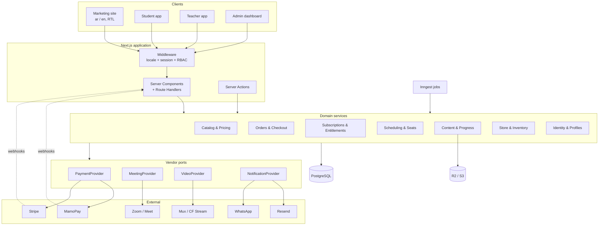

# Architecture — Alzenins Platform

## 1. Guiding principles

1. **One codebase, one deploy.** A single Next.js application serves the marketing site,
   the student app, the teacher app, and the admin dashboard. Separate them by route group
   and RBAC, not by repository. Splitting later is cheap; coordinating four repos now is not.
2. **The database is the source of truth for entitlements.** Never ask a payment provider
   "is this person allowed in?" at request time. Payments produce events; events grant
   entitlements; entitlements gate access.
3. **Vendors sit behind ports.** Payments, video conferencing, video hosting, email, and
   WhatsApp are each an interface with one or more adapters. MamoPay cannot cover every
   currency we sell in, so the payment port must exist from day one, not as a refactor.
4. **Server-side money.** Prices, currencies, discounts, and totals are resolved on the
   server from the price book. The client sends *what* is being bought, never *how much*.
5. **Idempotency everywhere the outside world touches us.** Webhooks, checkout callbacks,
   and booking submissions all replay. Every one carries a key.
6. **Arabic-first, RTL-first.** Locale is part of routing, not a runtime toggle bolted on.

## 2. Stack

| Layer | Choice | Why |
| --- | --- | --- |
| Framework | **Next.js (App Router) + TypeScript** | Already their stack; RSC keeps the marketing site fast and the dashboard co-located |
| UI | **Tailwind + shadcn/ui** | The live site already uses shadcn-shaped CSS variables — the design system carries over as-is |
| i18n | **next-intl** | Locale-segmented routes (`/ar`, `/en`), message catalogues, RTL-aware |
| Database | **PostgreSQL** (Neon or Supabase) | Relational integrity is the whole game here: seats, entitlements, orders |
| ORM | **Drizzle** | Typed SQL, explicit transactions and row locks — which seat allocation needs |
| Auth | **Auth.js (NextAuth) v5** with email OTP + Google | Owns its own tables in our Postgres; no vendor lock on the user record |
| Payments | **MamoPay** (primary) behind a `PaymentProvider` port | UAE/GCC coverage, subscriptions, 28 currencies |
| Payments (fallback) | **Stripe** adapter for JPY/KWD/BHD/OMR/JOD/MAD/ILS | Currencies MamoPay does not support — see ADR-0003 |
| Live classes | **Zoom** Server-to-Server OAuth (Google Meet adapter as alternative) | Already how they teach; automate meeting creation instead of changing behaviour |
| Video hosting | **Mux** or **Cloudflare Stream** | Signed playback URLs so recorded-course access is revocable |
| File storage | **Cloudflare R2** / S3 | Course materials, PDFs, product images |
| Background jobs | **Inngest** (or Trigger.dev) | Renewals, dunning, reminders, session lifecycle — durable, retryable, observable |
| Transactional email | **Resend** + React Email | Bilingual templates in the same repo |
| Messaging | **WhatsApp Business API** (360dialog / Twilio) | The dominant channel in MENA; reminders land where students actually read |
| Analytics | **PostHog** | Funnels, product analytics, session replay on the checkout |
| Errors | **Sentry** | |
| Hosting | **Vercel** + managed Postgres | |

> Alternatives were considered and rejected — see the ADRs in `docs/decisions/`.

## 3. System map



## 4. Domain services

Each is a folder of pure-ish TypeScript (`src/server/<domain>/`) with its own repository
functions. They call each other through explicit function calls, not shared table access —
so extracting one into a service later is mechanical.

### 4.1 Identity & Profiles
Users, sessions, roles (`student` | `teacher` | `admin` | `owner`), profile fields
(display name, locale, country, timezone, learning goals, level). Teachers carry a
`TeacherProfile` with bio, languages, native-speaker flag, and availability rules.

### 4.2 Catalog & Pricing
`Product` is the umbrella: a cohort course, a credit pack, a recorded course, or a physical
item. Each has one or more `Price` rows — **one per currency per billing interval**. Prices
are authored, not converted at runtime (ADR-0003). Admin CRUD lives here.

### 4.3 Orders & Checkout
Cart → `Order` (draft) → payment intent via `PaymentProvider` → hosted checkout → webhook →
`Order.paid` → fulfilment events. Every order carries an `idempotency_key`. Fulfilment is a
switch on line-item type: grant entitlement, allocate seat, add credits, or reserve stock.

### 4.4 Subscriptions & Entitlements
A `Subscription` mirrors provider state but is **not** authoritative for access.
It emits `Entitlement` rows: `(user, scope, resource, valid_from, valid_until, source)`.
All access checks read entitlements. Cancellation sets `valid_until`; it does not delete.
Dunning is a job: retry, notify, grace period, then expire the entitlement.

### 4.5 Scheduling & Seats
The heart of the product. Three shapes of time:

- **Cohort** — a recurring class group (`Course` → `Cohort` → generated `ClassSession` rows).
  Capacity lives on the cohort; `Enrollment` consumes a seat.
- **1:1 booking** — a teacher publishes `AvailabilityRule`s (weekly recurrence + exceptions);
  the system materialises bookable `Slot`s; a student spends a `Credit` to create a `Booking`.
- **Waitlist** — when a cohort is full, `WaitlistEntry` queues; freeing a seat promotes the
  head of the queue via a job.

Seat allocation runs inside a transaction with `SELECT ... FOR UPDATE` on the cohort row.
Everything is stored in UTC with an IANA timezone alongside; rendering is per-user.

### 4.6 Content & Progress
Recorded courses: `Module` → `Lesson` → `Asset` (video via signed playback token, or a file
in R2 via a short-lived signed URL). `Progress` tracks per-lesson completion. Access is an
entitlement check on every asset request — never a client-side hide.

### 4.7 Store & Inventory
Physical and digital SKUs, stock levels with reservation-on-order, variants, discount codes,
shipping zones mapped to the same country list as pricing, and order fulfilment states.

## 5. Key integration designs

### 5.1 Payments — the `PaymentProvider` port

```ts
interface PaymentProvider {
  readonly id: 'mamopay' | 'stripe'
  supportsCurrency(currency: Currency): boolean
  createCheckout(input: CheckoutInput): Promise<{ redirectUrl: string; providerRef: string }>
  createSubscription(input: SubscriptionInput): Promise<{ redirectUrl: string; providerRef: string }>
  cancelSubscription(providerRef: string): Promise<void>
  refund(providerRef: string, amount: Money): Promise<RefundResult>
  verifyWebhook(req: Request): Promise<ProviderEvent>
}
```

Routing rule: pick the provider that supports the resolved charge currency; MamoPay wins
ties. Webhooks land on `/api/webhooks/<provider>`, are signature-verified, deduplicated by
provider event id, written to a `webhook_event` table, then processed asynchronously. The
HTTP handler's only job is to persist and return 200 fast.

MamoPay specifics confirmed: payment links and subscription links via API, sandbox at
`sandbox.dev.business.mamopay.com`, webhook events for payment success/failure and
recurring success/failure, settlement in AED.

### 5.2 Live classes — the `MeetingProvider` port
When a `ClassSession` is created, a job provisions a Zoom meeting and stores the join URL,
host key, and meeting id. Join links are never public: a student hits
`/session/<id>/join`, we check enrolment + a time window, then redirect. Recordings, if
enabled, are fetched post-session and attached to the cohort's material library.

### 5.3 Calendar
- Per-user **ICS feed** (`/api/calendar/<token>.ics`) — subscribe once in Apple/Google/Outlook.
- Optional **Google Calendar two-way sync** for teachers (their availability is the
  scarce resource; letting them manage it in the tool they already use raises adoption).
- In-app calendar: month/week/agenda, timezone-aware, RTL-aware.
- Reminder jobs at T-24h and T-1h over email + WhatsApp.

## 6. Security & compliance

- Session cookies: `httpOnly`, `secure`, `sameSite=lax`; short-lived JWT + rotating refresh.
- RBAC enforced in middleware **and** re-checked in every server action. Middleware is a
  convenience, not the boundary.
- Row-level authorisation helpers per domain (`assertCanViewCohort(user, cohortId)`).
- PCI: fully outsourced — hosted checkout only, no card fields on our origin (SAQ-A).
- PII: minimal. Store country and timezone, not addresses, unless the store ships physical goods.
- Rate limits on auth, checkout, and booking endpoints.
- Audit log for every admin mutation (who, what, before, after).
- Secrets in the platform's secret store; nothing in the repo.

## 7. Environments

| Env | Purpose | Payments |
| --- | --- | --- |
| `local` | Development | Provider sandboxes, webhooks tunnelled |
| `preview` | Per-PR deploys | Sandbox |
| `staging` | Pre-release, seeded data | Sandbox |
| `production` | Live | Live keys |

Migrations run forward-only via Drizzle in CI before the deploy promotes.
