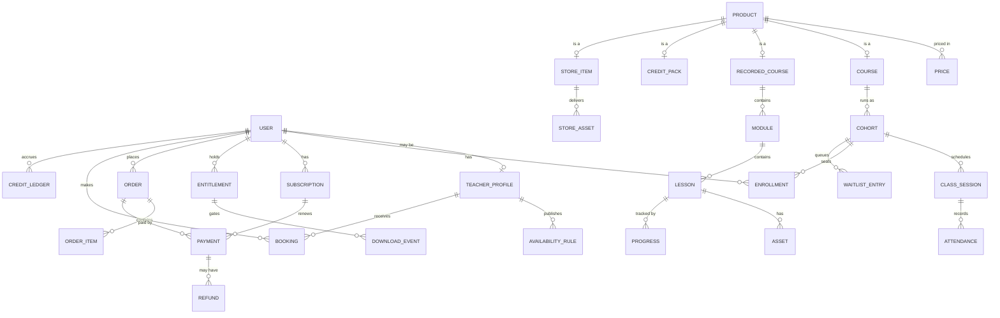

# Data Model — Alzenins Platform

Postgres. All timestamps `timestamptz` in UTC. All money as **integer minor units +
currency code** — never floats. IDs are ULIDs unless noted.

## 1. Entity map

## 2. Core tables

### Identity

**`user`** — `id`, `email` (citext, unique), `email_verified_at`, `name`, `locale`
(`ar`|`en`), `country` (ISO-3166-1 alpha-2), `timezone` (IANA), `phone_e164`,
`role` (`student`|`teacher`|`admin`|`owner`), `status`, `created_at`.

**`teacher_profile`** — `user_id` (PK/FK), `headline_ar`, `headline_en`, `bio_ar`, `bio_en`,
`languages` (text[]), `is_native_speaker`, `hourly_credit_cost`, `booking_lead_time_minutes`,
`buffer_minutes`, `avatar_url`, `is_bookable`.

### Catalog & pricing

**`product`** — `id`, `slug` (unique), `kind` (`cohort_course`|`recorded_course`|
`credit_pack`|`store_item`), `title_ar`, `title_en`, `summary_ar`, `summary_en`,
`description_ar`, `description_en`, `hero_image_url`, `status` (`draft`|`active`|`archived`),
`tags` (text[]), `created_at`.

**`price`** — `id`, `product_id`, `currency` (ISO-4217), `amount_minor` (bigint),
`interval` (`one_time`|`month`|`quarter`|`year`), `interval_count`, `compare_at_minor`
(for strike-through), `is_default_for_currency`, `active`, `valid_from`, `valid_until`.

> **Invariant:** at most one active default price per `(product, currency, interval)`.
> Enforced by a partial unique index.

### Live classes

**`course`** — `product_id` (PK/FK), `level` (`N5`..`N1`, or generic), `language`
(`ja`|`en`|…), `total_weeks`, `sessions_per_week`, `session_minutes`, `syllabus_url`.

**`cohort`** — `id`, `course_id`, `name`, `teacher_id`, `capacity` (int),
`seats_taken` (int, denormalised counter), `starts_on`, `ends_on`, `timezone`,
`schedule_rule` (RRULE text, e.g. `FREQ=WEEKLY;BYDAY=MO,WE;BYHOUR=18`),
`gender_policy` (`any`|`female_only`), `enrolment_state`
(`draft`|`open`|`full`|`closed`|`running`|`finished`), `meeting_provider_ref`.

> **Invariant:** `seats_taken <= capacity`, enforced by a CHECK constraint **and** by
> allocating inside a transaction that takes `SELECT ... FROM cohort WHERE id = $1 FOR UPDATE`.
> The counter is a performance aid; the `enrollment` rows are the truth, and a nightly
> job reconciles the two and alerts on drift.

**`class_session`** — `id`, `cohort_id`, `starts_at`, `ends_at`, `status`
(`scheduled`|`live`|`finished`|`cancelled`), `meeting_url`, `meeting_id`,
`recording_asset_id`, `teacher_id` (override for substitutes), `notes`.

**`enrollment`** — `id`, `user_id`, `cohort_id`, `status` (`active`|`paused`|`cancelled`|
`completed`), `source` (`subscription`|`order`|`manual`), `subscription_id`, `order_id`,
`started_at`, `ended_at`. Unique on `(user_id, cohort_id)` where status is active.

**`waitlist_entry`** — `id`, `user_id`, `cohort_id`, `position`, `created_at`,
`notified_at`, `expires_at`. Promotion is FIFO with a hold window.

**`attendance`** — `class_session_id`, `user_id`, `state` (`present`|`late`|`absent`|
`excused`), `minutes_attended`, `recorded_by`.

### 1:1 booking

**`availability_rule`** — `id`, `teacher_id`, `rrule`, `timezone`, `slot_minutes`,
`valid_from`, `valid_until`, `kind` (`open`|`blackout`). Blackouts subtract from open rules.

**`slot`** (materialised, rolling 60-day horizon, regenerated by a job) — `id`, `teacher_id`,
`starts_at`, `ends_at`, `state` (`free`|`held`|`booked`). Unique on `(teacher_id, starts_at)`.

**`booking`** — `id`, `student_id`, `teacher_id`, `slot_id` (unique), `status`
(`confirmed`|`cancelled_by_student`|`cancelled_by_teacher`|`completed`|`no_show`),
`credit_ledger_id`, `meeting_url`, `cancellation_deadline_at`.

**`credit_ledger`** — `id`, `user_id`, `delta` (int, + on purchase, − on booking),
`reason` (`purchase`|`booking`|`refund`|`expiry`|`admin_grant`), `booking_id`, `order_id`,
`expires_at`, `created_at`. Balance is `SUM(delta)` over non-expired rows — an append-only
ledger, never a mutable counter.

### Commerce

**`order`** — `id`, `user_id`, `status` (`draft`|`pending_payment`|`paid`|`failed`|
`refunded`|`cancelled`), `display_currency`, `charge_currency`, `subtotal_minor`,
`discount_minor`, `tax_minor`, `tax_rate`, `tax_treatment` (`inclusive`|`exclusive`),
`total_minor`, `discount_code`, `country`, `idempotency_key` (unique), `provider`,
`provider_ref`, `settled_amount_minor`, `settled_currency`, `placed_at`.

> **`display_currency` and `charge_currency` are separate columns**, per
> [ADR-0003](decisions/ADR-0003-multi-currency-strategy.md). For **nine** of the sixteen
> markets they differ (Qatar joined the list after the sandbox spike found QAR is
> rejected), and reporting needs both. `tax_rate` and `tax_treatment` are stored
> per order rather than derived at report time, so historical orders stay correct after a
> rate change ([ADR-0007](decisions/ADR-0007-vat-treatment.md)). No `shipping_minor` — the
> store is digital only.

**`order_item`** — `id`, `order_id`, `product_id`, `price_id`, `quantity`,
`unit_amount_minor`, `total_minor`, `fulfilment_state`, `fulfilment_payload` (jsonb —
e.g. the cohort to enrol into).

**`payment`** — `id`, `order_id`, `subscription_id`, `provider`, `provider_ref` (unique),
`status` (`pending`|`succeeded`|`failed`|`refunded`), `amount_minor`, `currency`,
`settled_amount_minor`, `settled_currency`, `fee_minor`, `failure_code`, `paid_at`.

**`subscription`** — `id`, `user_id`, `product_id`, `price_id`, `provider`, `provider_ref`,
`status` (`trialing`|`active`|`past_due`|`paused`|`cancelled`|`expired`),
`current_period_start`, `current_period_end`, `cancel_at_period_end`, `dunning_attempts`,
`grace_until`, `cohort_id` (if it grants a seat).

**`entitlement`** — `id`, `user_id`, `scope` (`cohort`|`recorded_course`|`store_item`|
`store_discount`|`feature`), `resource_id`, `valid_from`, `valid_until` (nullable = perpetual), `source`
(`subscription`|`order`|`manual`), `source_id`, `revoked_at`.

> **Invariant:** *all* access checks read `entitlement`. No feature queries `subscription`
> or `payment` directly. This is what makes refunds, admin grants, scholarships, and
> grace periods all work through one code path.

**`webhook_event`** — `id`, `provider`, `provider_event_id` (unique), `type`, `payload`
(jsonb), `received_at`, `processed_at`, `attempts`, `error`. Dedup lives here.

### Content

**`recorded_course`** — `product_id` (PK/FK), `level`, `total_minutes`, `drip_strategy`
(`all_at_once`|`weekly`|`on_schedule`).

**`module`** — `id`, `recorded_course_id`, `title_ar`, `title_en`, `position`, `unlock_after_days`.

**`lesson`** — `id`, `module_id`, `title_ar`, `title_en`, `position`, `duration_seconds`,
`is_preview` (free sample).

**`asset`** — `id`, `lesson_id`, `kind` (`video`|`pdf`|`audio`|`link`), `provider`
(`mux`|`r2`|`external`), `provider_ref`, `filename`, `size_bytes`, `locale`.

**`progress`** — `user_id`, `lesson_id`, `seconds_watched`, `completed_at`, `last_seen_at`.

### Store (digital only — decided 2026-08-27)

**`store_item`** — `product_id` (PK/FK), `level`, `file_count`, `total_bytes`.
No `weight_grams`, no `requires_shipping`: the store sells digital goods only.

**`store_asset`** — `id`, `store_item_id`, `kind` (`pdf`|`audio`|`archive`), `provider`
(`r2`), `provider_ref`, `filename`, `size_bytes`, `locale`, `position`.

> There is **no `variant`, `stock_movement`, `shipping_zone` or `shipping_rate` table.**
> Digital goods have no stock to oversell and nowhere to ship. A purchase grants an
> `entitlement` with scope `store_item`, and downloads are short-lived signed URLs issued
> per request after an entitlement check — the same mechanism as recorded courses.

**`download_event`** — `id`, `user_id`, `store_asset_id`, `entitlement_id`, `ip`,
`created_at`. Not for analytics — for spotting one signed link being hammered.

**`discount_code`** — `id`, `code` (unique), `kind` (`percent`|`fixed`), `value`,
`currency` (for fixed), `applies_to` (jsonb), `max_redemptions`, `redemptions`,
`starts_at`, `ends_at`, `min_order_minor`.

### Ops

**`audit_log`** — `id`, `actor_id`, `action`, `entity`, `entity_id`, `before` (jsonb),
`after` (jsonb), `ip`, `created_at`.

**`notification`** — `id`, `user_id`, `channel` (`email`|`whatsapp`|`in_app`), `template`,
`locale`, `payload`, `status`, `sent_at`, `provider_ref`.

## 3. Invariants worth writing tests for first

1. A cohort can never exceed `capacity`, under 50 concurrent checkouts.
2. Replaying the same webhook event id twice grants exactly one entitlement.
3. Cancelling a subscription mid-period leaves access valid until `current_period_end`.
4. A refunded order revokes its entitlements and returns its credits.
5. Booking the same slot from two devices simultaneously succeeds exactly once.
6. Credit balance can never go negative.
7. A price is never resolved from a client-supplied value.
8. An expired entitlement blocks video playback token issuance, not just the UI link.
9. No market ever resolves to a charge currency MamoPay cannot process (already tested).
10. An order's stored `tax_rate` is unaffected by a later change to the configured rate.
