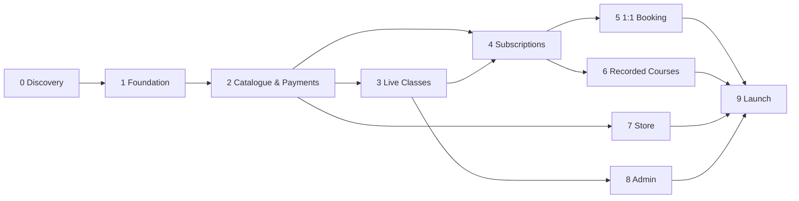

# Roadmap — Alzenins Platform

**The rule:** one phase at a time. A phase closes only when its sign-off checklist is fully
ticked and the owner has signed the phase file. Nothing from Phase N+1 starts before that.

Estimates assume a small team (1–2 engineers + design input). They are ranges, not promises.

---

## Phase overview

| # | Phase | Outcome | Est. |
| --- | --- | --- | --- |
| **0** | Discovery & Sign-off | Decisions locked, accounts opened, nothing built on sand | 1 week |
| **1** | Foundation | Repo, design system, i18n/RTL, auth, profiles, DB, CI/CD | 2–3 weeks |
| **2** | Catalogue & Payments | Products, multi-currency price books, MamoPay checkout, orders | 3–4 weeks |
| **3** | Live Classes & Calendar | Cohorts, seats, sessions, Zoom, enrolment, reminders | 3–4 weeks |
| **4** | Subscriptions & Entitlements | Recurring billing, access control, dunning, self-serve billing | 2–3 weeks |
| **5** | 1:1 Booking with Natives | Availability, slots, credits, booking, cancellation policy | 2–3 weeks |
| **6** | Recorded Courses (LMS) | Video, materials, progress, drip, gated access | 3 weeks |
| **7** | Store (digital) | Digital catalogue, entitlement delivery, discounts | 1–2 weeks |
| **8** | Admin & Operations | Full dashboard, reporting, audit, teacher tooling | 2–3 weeks |
| **9** | Hardening & Launch | Security, performance, a11y, load test, migration, cutover | 2 weeks |
| **10** | Post-launch | Growth, analytics-driven iteration, v2 candidates | ongoing |

**Total to launch: roughly 5–7 months.** (Phase 7 shrank to 1–2 weeks once the store was scoped digital-only.)

> **A faster path exists.** If you want revenue sooner, Phases 1 → 2 → 3 → 4 is a
> **coherent, shippable product on its own** (~3–4 months): accounts, paid cohort seats in
> local currency, live classes with a calendar, and working subscriptions. That is the whole
> current business, automated. Phases 5–7 are new revenue lines and can ship behind flags
> after launch. I'd recommend that split, but the full plan is laid out either way.

---

## Phase details

Each phase has its own file with the full task list, acceptance criteria, and sign-off block:

- [Phase 0 — Discovery & Sign-off](phases/phase-0-discovery.md)
- [Phase 1 — Foundation](phases/phase-1-foundation.md)
- [Phase 2 — Catalogue & Payments](phases/phase-2-catalogue-payments.md)
- [Phase 3 — Live Classes & Calendar](phases/phase-3-live-classes.md)
- [Phase 4 — Subscriptions & Entitlements](phases/phase-4-subscriptions.md)
- [Phase 5 — 1:1 Booking](phases/phase-5-booking.md)
- [Phase 6 — Recorded Courses](phases/phase-6-lms.md)
- [Phase 7 — Store (digital)](phases/phase-7-store.md)
- [Phase 8 — Admin & Operations](phases/phase-8-admin.md)
- [Phase 9 — Hardening & Launch](phases/phase-9-launch.md)

---

## Dependency graph

Phases 5, 6, and 7 are genuinely independent of each other. If a second engineer joins,
that is where they parallelise.

---

## The sign-off ritual

At the end of each phase:

1. Engineer walks the owner through a **live demo on staging**, using the acceptance
   criteria as the script. Not a slide deck — the actual product.
2. Owner ticks each criterion, or files a gap. Gaps are fixed inside the phase, not deferred.
3. Any decision taken during the phase that isn't yet an ADR gets written up.
4. The journal entry for the day records the sign-off.
5. The owner adds name + date to the phase file's sign-off block.
6. `AGENTS.md` § "Current status" is updated to the next phase.

A phase can also be signed off **with explicit carve-outs** — write them into the block,
name where they land, and move on. What's forbidden is silent slippage.

---

## Open questions

**Answered 2026-08-27:**

| # | Question | Answer |
| --- | --- | --- |
| 4 | Currency fallback strategy | **Option A** — MamoPay only, fallback charge currency for the 8 uncovered markets. → [ADR-0003](decisions/ADR-0003-multi-currency-strategy.md) |
| 3 | MamoPay account | Sandbox API key issued and stored in the local environment. Phase 2 unblocked. |
| 6 | VAT | UAE standard 5%, tax-inclusive, **provisional** pending the accountant. → [ADR-0007](decisions/ADR-0007-vat-treatment.md) |
| 8 | Store: physical or digital | **Digital only.** No shipping, stock, or returns — Phase 7 roughly halves. |
| 1 | Existing codebase | Fresh app, marketing pages rebuilt. Done in Phase 1. |

**Still open:**

2. **Which languages beyond Japanese?** "Language training website" implies more. Does the
   data model need to be multi-language from day one, or is Japanese-only fine for v1 with
   a `language` column reserved? (Recommendation: reserve the column, ship Japanese-only.)
5. **Zoom account tier.** Server-to-Server OAuth apps need a paid Zoom plan. Confirmed?
7. **Existing student migration.** How many active students, and where does their data live
   now (spreadsheet? WhatsApp? nothing)? Determines the Phase 9 migration effort.
9. **Teacher payouts.** Are instructors salaried, or do they need per-session payout
   tracking? Payouts are out of v1 scope unless you say otherwise.
10. **Brand assets.** Do we have the logo in vector, and a font licence for Cairo and
    Plus Jakarta Sans in production? (Both are open-licensed on Google Fonts — likely fine.)
